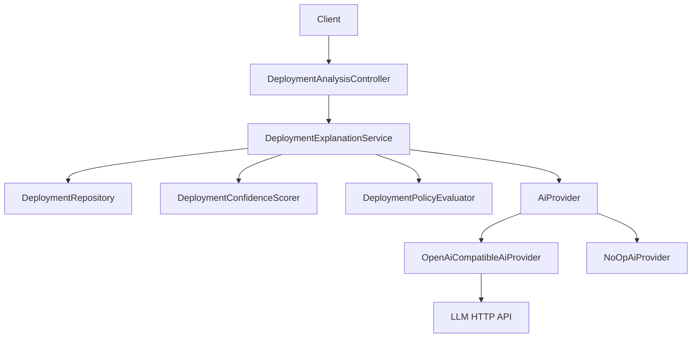

# Requirements

### Overview & Goals
Implement **Step 9 only**: LLM integration via a clean `AiProvider` abstraction that generates deployment risk explanations from structured analysis data (score, factors, findings, CI evidence, commit metadata). AI must **not** calculate scores, override policy, invent findings, or trigger recovery.

### Scope
**In scope**
- `AiProvider` interface + one initial provider (OpenAI-compatible HTTP or configurable stub/noop for offline demos)
- Configuration via env/`opsvision.ai.*` (no hardcoded secrets)
- Service that builds a structured prompt context from existing score/policy/evidence models
- REST endpoint(s) to fetch/generate explanation for a deployment (and optionally include explanation on analyze when enabled)
- Unit tests with **mocked** `AiProvider`
- Single commit + push as **Haya Elnaggar** (repo `user.name` / `user.email`); **no** Junie co-author trailer

**Out of scope**
- Steps 10+ (K8s, incidents, RCA, recovery, postmortems, GitHub issues)
- Making LLM authoritative for score/policy
- Multiple production LLM SDKs if one HTTP adapter covers OpenAI/Gemini-compatible endpoints

### Functional Requirements
- Given deployment id with evidence/score inputs, return explanation: concise risk summary, key concerns, suggested remediation
- Provider failures surface as controlled errors (ProblemDetail), not corrupt score/policy
- Default safe mode when AI disabled or API key missing (clear message / empty explanation without breaking analyze)

### Non-Functional
- Constructor injection; mockable boundary
- Secrets only via env (update `.env.example`)
- `mvn clean test` green

# Technical Design

### Current Implementation
- Steps 1–8 done; latest: `e4db112` `feat(api): expose deployment analysis REST endpoints`
- Package root: `com.opsvision` (not `com.deploysense`)
- Analysis orchestration: `DeploymentAnalysisService` + `DeploymentAnalysisController`
- Deterministic score: `DeploymentConfidenceScorer` / `ConfidenceScoreResult` / `ScoreFactor`
- Policy: `DeploymentPolicyEvaluator` / `PolicyEvaluationResult`
- External client pattern: `GitHubApiClient` interface + `RestClientGitHubApiClient` + `*Properties`
- Errors: `GlobalExceptionHandler` (RFC 9457)
- Config: `application.yml` under `opsvision.*`

### Key Decisions
1. **Package** `com.opsvision.ai` with `provider`, `service`, `model`, `config` (and thin controller only if kept separate from deployment package).
2. **Abstraction**: `AiProvider.generateDeploymentExplanation(DeploymentExplanationRequest) -> DeploymentExplanation` — single method for Step 9; swappable beans.
3. **Initial provider**: OpenAI-compatible chat completions via Spring `RestClient` (works with OpenAI and many proxies); optional `noop`/`logging` provider when `opsvision.ai.enabled=false` or provider=`none`.
4. **AI never owns score/policy**: explanation service only *reads* scorer/policy outputs and entity snapshots; no writes to score fields.
5. **Persistence**: optional skip of DB table for MVP (generate on demand); only add Flyway if we store explanations — prefer **on-demand + optional cache in response DTO** unless product needs history (keep no migration unless necessary).
6. **Git identity**: commit/push with existing local git config (`Haya Elnaggar` / user email); do not set Junie author or `Co-authored-by: Junie`.

### Proposed Changes
- Models: request context (commit/branch/env, score + factors, policy decision + reasons, evidence summaries, finding titles/severities); response (summary, concerns[], remediations[], provider name, model id).
- `DeploymentExplanationService`: load deployment + evidence/findings, run score+policy (reuse mapper helpers from analysis service), call `AiProvider`.
- Wire optional field on `DeploymentAnalysisResponse` **or** dedicated `GET /api/v1/deployments/{id}/explanation` to avoid forcing LLM on every analyze (prefer dedicated endpoint + flag `includeExplanation` on analyze if cheap).
- `AiProperties`: enabled, provider, base-url, api-key, model, timeouts, max-tokens.
- Exception type for AI failures handled in `GlobalExceptionHandler` (502/503).
- Tests: mock provider returns fixed text; service builds correct context; disabled provider behavior.

### File Structure (expected)
- `src/main/java/com/opsvision/ai/**`
- `src/test/java/com/opsvision/ai/**`
- Touch: `application.yml`, `.env.example`, possibly `DeploymentAnalysisController` / DTOs / `GlobalExceptionHandler`

### Architecture Diagram

### Risks
- Flaky live LLM calls in CI → always mock in unit tests; no live calls in default test profile
- Prompt hallucination → system prompt forbids inventing metrics/findings; only use provided structured context

# Testing

### Validation Approach
- Unit tests with Mockito for `AiProvider` and explanation service
- Controller test with mocked service/provider if endpoint added
- Full `mvn clean test`

### Key Scenarios
- Happy path: structured context → explanation fields populated
- AI disabled / missing key: graceful degradation
- Provider throws: mapped HTTP problem, score/policy unchanged

### Edge Cases
- Deployment not found
- Empty evidence/findings
- Malformed LLM JSON → controlled parse error or plain-text fallback

# Delivery Steps

### ✓ Step 1: Add AI provider abstraction and config
AiProvider interface, models, properties, and OpenAI-compatible + no-op implementations exist and bind via configuration.

- Create `com.opsvision.ai` packages: provider interface, request/response models, `AiProperties` / `@EnableConfigurationProperties`, RestClient-based OpenAI-compatible provider, `NoOpAiProvider` when disabled.
- Add `opsvision.ai.*` to `application.yml` and document env vars in `.env.example` (API key, base URL, model, enabled flag).
- Ensure secrets are never hardcoded; constructor injection only.

### ✓ Step 2: Implement explanation service and REST exposure
Clients can request a deployment risk explanation built only from deterministic analysis inputs.

- Implement `DeploymentExplanationService` that loads deployment/evidence/findings, reuses scoring + policy outputs, and calls `AiProvider` without altering score/policy authority.
- Expose `GET` (and optional analyze flag) under existing deployment API patterns; extend DTOs/mapper; handle AI errors in `GlobalExceptionHandler`.
- Keep controllers thin; do not expose JPA entities.

### ✓ Step 3: Tests, verify, commit and push as Haya
Step 9 is green in CI locally and published on main under the user’s git identity.

- Add unit tests with mocked `AiProvider` (happy path, disabled AI, provider failure, missing deployment).
- Run `mvn clean test` and fix regressions from this step only.
- Commit message exactly: `feat(ai): add AI deployment risk explanations`.
- Author/committer from local `git config` (Haya Elnaggar); no Junie trailer; `git push origin main`; confirm `git log -1 --format=fuller` shows user name/email.
- Stop after Step 9; do not start Step 10.